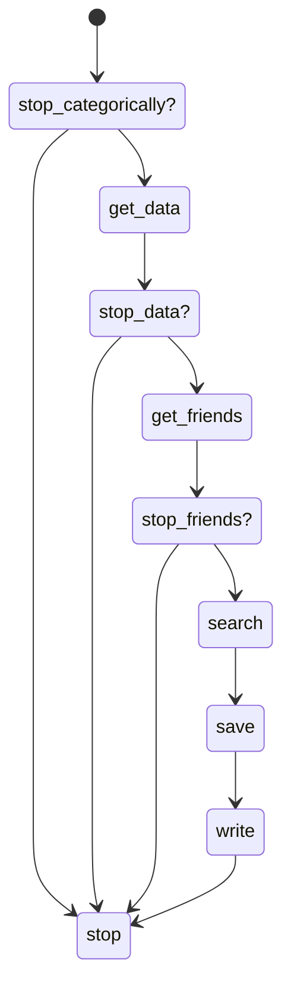
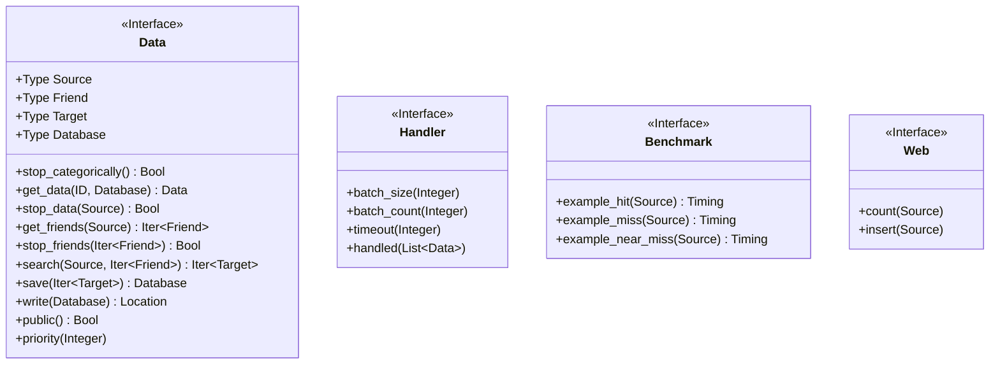
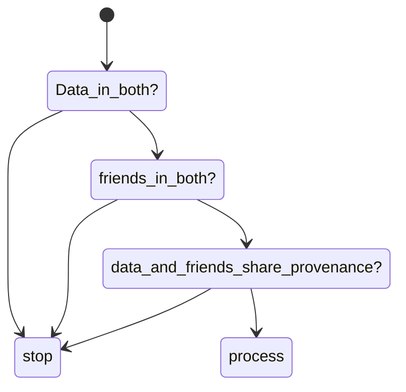

# silkworm
A library for append-only-database backed recursive search at scale

```mermaid
stateDiagram-v2
    [*] --> stop_categorically?
    stop_categorically? --> stop
    stop_categorically? --> get_data
    get_data --> stop_data?
    stop_data? --> stop
    stop_data? --> get_friends
    get_friends --> stop_friends?
    stop_friends? --> stop 
    stop_friends? --> search 
    search --> save 
    save --> write 
    write --> stop
```

```mermaid
classDiagram
    class Data{
        <<Interface>>
      +Type Source
      +Type Friend
      +Type Target
      +Type Database
      +stop_categorically() Bool
      +get_data(ID, Database) Data
      +stop_data(Source) Bool
      +get_friends(Source) Iter~Friend~
      +stop_friends(Iter~Friend~) Bool
      +search(Source, Iter~Friend~) Iter~Target~
      +save(Iter~Target~) Database
      +write(Database) Location
      +public() Bool
      +priority(Integer)
    }
    class Handler {
        <<Interface>>
        +batch_size(Integer)
        +batch_count(Integer)
        +timeout(Integer)
        +handled(List~Data~)
    }
    class Benchmark{
        <<Interface>>
        +example_hit(Source) Timing
        +example_miss(Source) Timing
        +example_near_miss(Source) Timing
    }
    class Web{
        <<Interface>>
        +count(Source)
        +insert(Source)
    }
```

```mermaid
stateDiagram-v2
    [*] --> Data_in_both?
    Data_in_both? --> stop
    Data_in_both? --> friends_in_both?
    friends_in_both? --> stop 
    friends_in_both? --> data_and_friends_share_provenance?
    data_and_friends_share_provenance? --> stop
    data_and_friends_share_provenance? --> process
```